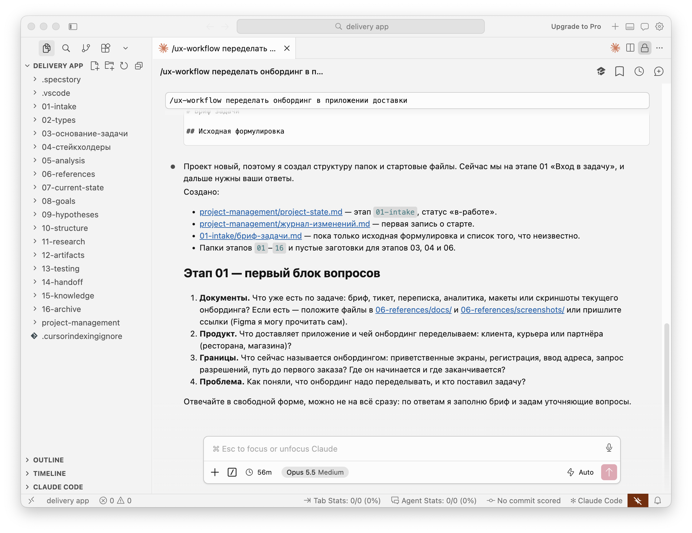

# ux-workflow

A skill for Claude Code and Cursor that walks a UX designer through a task step by step, from the first request to developer handoff. It asks questions, files the answers where they belong, and remembers which stage you stopped at.

[Русская версия](README.md)



*The skill at work in Cursor: project folders on the left, the first block of questions on the right. The interface language is Russian.*

> **Language note.** The skill is written in Russian: it talks to you in Russian and keeps all project files in Russian. To use it in another language, translate `SKILL.md` and the files in `references/`.

## Why

On a long UX task the context scatters: the brief is in one chat, the decisions in another, the interview results in a third. A month later it is hard to recall why an option was chosen and what comes next.

The skill keeps everything in the project folder. At the start of each session it reads `project-state.md` and reports the current stage, the status and the next step.

## What it does

- Creates the project folder structure and starter files.
- Leads you through 15 stages and never skips ahead without your confirmation.
- Asks questions in small blocks and saves each answer to the right file straight away.
- Keeps decisions apart from events: the reasoning lives in one file, the timeline in another.
- At the end of a session it lists the pending edits and writes them only after you confirm.
- Checks interview quotes against the source word for word before writing them down.
- Keeps `project-state.md` from bloating on long projects.

## Install

Run this in a terminal (requires Node.js):

```bash
npx skills add antonshappo/ux-workflow-skill
```

Or manually:

```bash
git clone https://github.com/antonshappo/ux-workflow-skill.git
cp -R ux-workflow-skill/skills/ux-workflow ~/.claude/skills/
```

## Usage

Open your project folder in Claude Code or Cursor and type `/ux-workflow`, or just describe the task: "we need to redo the onboarding, where do I start?"

- **New project.** The skill creates the folders and starts at stage 01.
- **Returning to a project.** The skill reads `project-state.md` and offers to continue where you left off.
- **End of work.** Ask it to close the session, and it updates the state, the change log and the open questions.

## The 15 stages

| # | Stage | When it applies |
|---|-------|-----------------|
| 01 | Task intake | Always |
| 02 | Task type | Always |
| 03 | Rationale for the task | Always |
| 04 | Requester and stakeholders | Always |
| 05 | Data analysis and follow-up questions | Always |
| 06 | References | Internal always, external optional |
| 07 | Current state | Only when improving something existing |
| 08 | Goals and success criteria | Always |
| 09 | Hypotheses and solution options | Always |
| 10 | Solution structure | Depends on complexity |
| 11 | Research | When hypotheses need testing |
| 12 | Solution artifacts | Always |
| 13 | Testing | When there is something to test |
| 14 | Handoff | Always |
| 15 | Outcomes and lessons | As needed |

The skill recognises four task types, which can be combined: improving something existing, building something new, a concept, and research. The type decides which stages apply and which questions are asked.

It also records how well the task is grounded (low, medium or high confidence), so you can see the quality of the brief you are working from.

## What appears in your project folder

Folder and file names are in Russian or English exactly as shown; the comments are translations.

```
project-management/
  project-state.md             ← where I am and what comes next
  решения-и-обоснования.md     ← decisions and their reasoning
  журнал-изменений.md          ← change log

01-intake/
02-types/
03-основание-задачи/           ← rationale for the task
04-стейкхолдеры/               ← stakeholders
05-analysis/
06-references/
07-current-state/
08-goals/
09-hypotheses/
10-structure/
11-research/
12-artifacts/
13-testing/
14-handoff/
15-knowledge/
16-archive/
```

Files inside the stage folders are created as the work reaches them, not all at once.

## What is inside the skill

```
skills/ux-workflow/
  SKILL.md                          ← rules and order of work
  references/
    stages-detail.md                ← instructions for each stage
    questions-bank.md               ← questions for each stage
    folder-structure.md             ← folder structure
    project-state-template.md       ← template of the state file
```

## License

MIT
